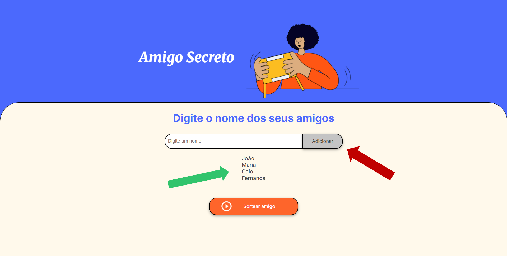
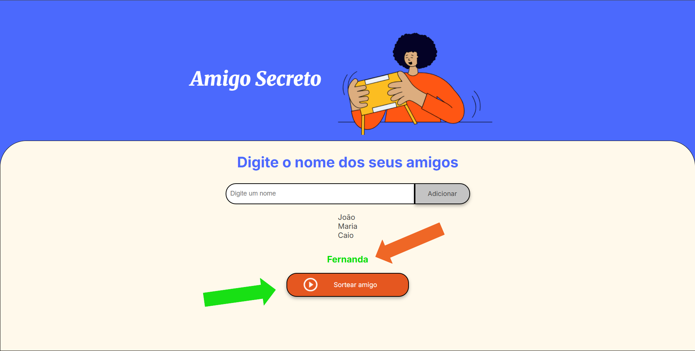

<h1 align="center">Desafio do Jogo do Amigo Secreto</h1>
<h3>Este projeto se trata de um jogo onde você pode adicionar todos os seus amigos à uma lista e sortear-los para descobrir quem será o seu amigo secreto. </h3>

<h2>Como Jogar 👾</h2>
<h3><b>Você poserá acessar a página pelo link:</b>  desafio-do-amigo-secreto-five.vercel.app</h3>

* <h4> Primeiramente você deve digitar os nomes dos seus amigos na caixinha branca.
  </h4>

* #### Depois você deve clicar no botão ao lado "Adicionar" e o nome será acrescentado à lista de amigos que aparecerá logo abaixo. 

  

* #### Para sortear um amigo, basta clicar no botão "Sortear Amigo" e o nome da pessoa sorteada irá aparecer destacada em verde logo acima.  

* #### O nome do amigo sorteado irá desaparecer da lista logo após ser escolhido para que você ainda possa sortear os outros amigos.

<h2>Tecnologias Usadas 🔨</h2>

* HTML  

### CSS
### 
### 
